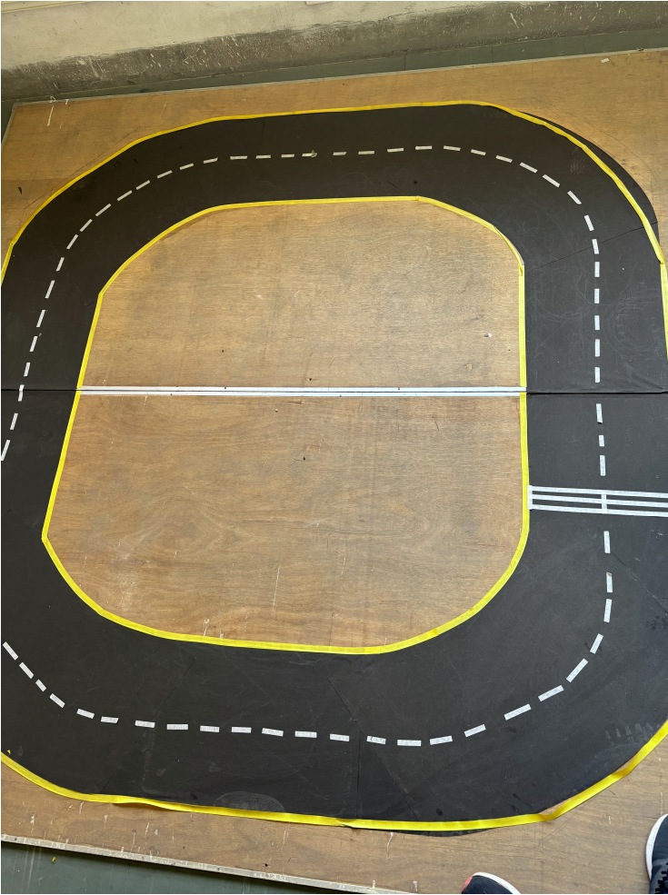
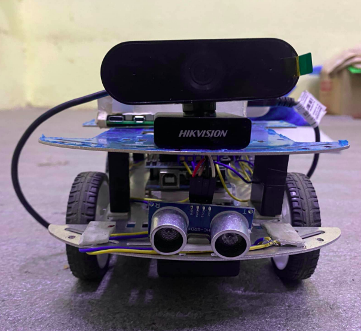
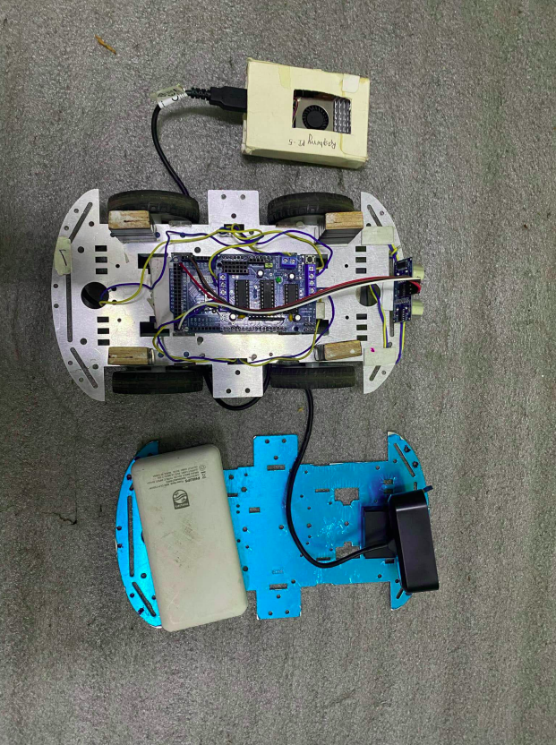

# AutoTrack : Autonomous Self-Driving Car System

AutoTrack is a Raspberry Pi-based autonomous vehicle that uses computer vision and machine learning to navigate in real time. It detects lane markings, reads traffic signs, and avoids obstacles, all processed on a Raspberry Pi 4B and executed through an Arduino-controlled motor system.

A full project report with system design, methodology, and results is available as a separate PDF document.

---

## How It Works

The car captures a live feed from a USB webcam. Each frame is processed to detect lane lines using OpenCV's Hough Line Transform. Based on the lane positions, the system decides whether to steer left, right, or go straight. Simultaneously, a fine-tuned YOLOv11 model scans for traffic signs (Stop, Speed Limit 40, Speed Limit 70) and issues the appropriate commands. Ultrasonic sensor data from the Arduino is read in a background thread, if an obstacle is detected, the vehicle halts immediately.

All decisions are sent to the Arduino as short text commands over UART serial, which then drives the motors accordingly.

---

## Modules

**`main_controller.py`** is the entry point. It ties everything together, opens the camera and serial connection, runs the perception loop, and handles graceful shutdown.

**`lane_detection.py`** handles the full lane detection pipeline: edge detection, ROI masking, Hough line detection, slope-based lane classification, and stateful directional decision logic. It can also be run standalone for testing.

**`sign_detection.py`** wraps the YOLOv11 model for traffic sign inference. It filters low-confidence detections, maps class labels to actions, and includes a debounce timer for stop signs to prevent repeated triggers.

**`serial_comm.py`** manages UART communication with the Arduino. It is thread-safe, auto-detects the Arduino port, validates commands, and falls back to mock mode if `pyserial` is not installed.

---

## Hardware

- Raspberry Pi 4B
- Arduino Uno
- USB Webcam
- HC-SR04 Ultrasonic Sensor
- L298N Motor Driver

---

## Dependencies

```bash
pip install opencv-python numpy pyserial ultralytics
```

Place the fine-tuned YOLOv11 weights at `models/yolov11_traffic_signs.pt` before running sign detection. If the model file is missing, the system will continue operating using lane detection only.

---

## Running the System

```bash
python main_controller.py
python main_controller.py --port /dev/ttyUSB0
python main_controller.py --no-preview   # headless mode
```

Press `q` to quit when running with preview windows.

---


## Serial Commands

The Raspberry Pi sends these commands to the Arduino over serial: `left`, `right`, `straight`, `stop`, `speed_40`, `speed_70`.

The Arduino sends back plain-text lines. Any line containing `"obstacle detected"` triggers an immediate stop.

---


## Experimental Setup and Hardware Platform

The AutoTrack system was evaluated using a custom-built autonomous vehicle platform and a dedicated testing arena designed to simulate real-world lane-following scenarios. The experimental setup consists of a Raspberry Pi-based vehicle equipped with a vision system, obstacle detection sensors, and an Arduino-controlled drive mechanism.

### Testing Arena

The vehicle was tested on a closed-loop track constructed using high-contrast lane markings. The track contains straight segments and curved sections, allowing the system to evaluate lane detection performance under varying road geometries. The continuous loop design enables prolonged autonomous operation and repeatable testing conditions.



*Figure 1. Closed-loop testing arena used for autonomous navigation experiments.*

---

### Front View of the Vehicle

The front section of the vehicle houses the primary perception components. A USB webcam is mounted at the front to capture real-time road imagery for lane detection and traffic sign recognition. An HC-SR04 ultrasonic sensor is positioned below the camera to detect obstacles and ensure safe navigation.

This sensor arrangement allows the vehicle to simultaneously perceive lane boundaries, identify traffic signs, and monitor obstacles in its path.



*Figure 2. Front view showing the USB camera and ultrasonic sensor assembly.*

---

### Top View of the Vehicle

The top view highlights the internal hardware architecture of the autonomous platform. The system integrates a Raspberry Pi 4B for image processing and decision-making, an Arduino Uno for low-level motor control, a motor driver module, power supply components, and sensor connections.

The modular design allows easy access to individual components for maintenance, debugging, and future upgrades.



*Figure 3. Top view of the autonomous vehicle showing the onboard computing and control hardware.*

---

### System Components

The complete hardware platform consists of:

- Raspberry Pi 4B for computer vision and autonomous decision-making
- Arduino Uno for motor and sensor control
- USB Webcam for lane and traffic sign detection
- HC-SR04 Ultrasonic Sensor for obstacle detection
- L298N Motor Driver for motor actuation
- Differential drive robotic chassis
- External power supply system

Together, these components enable real-time perception, navigation, obstacle avoidance, and autonomous vehicle control within the experimental environment.

## Project Structure

```
autotrack/
├── modules
    ├── main_controller.py
    ├── lane_detection.py
    ├── sign_detection.py
    ├── serial_comm.py
├── report.pdf
```
